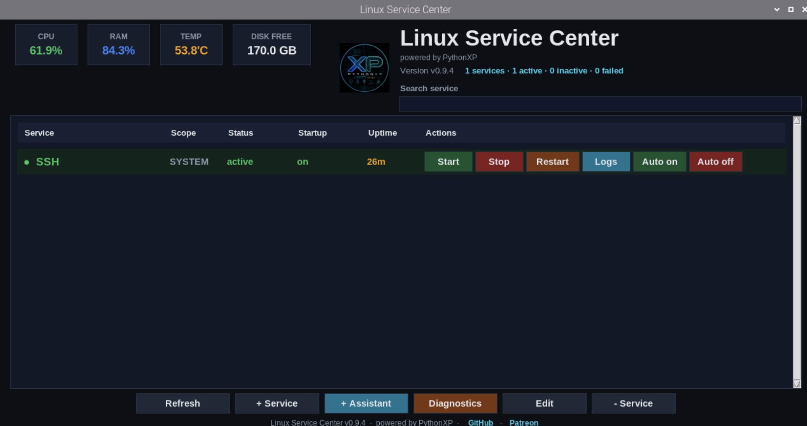
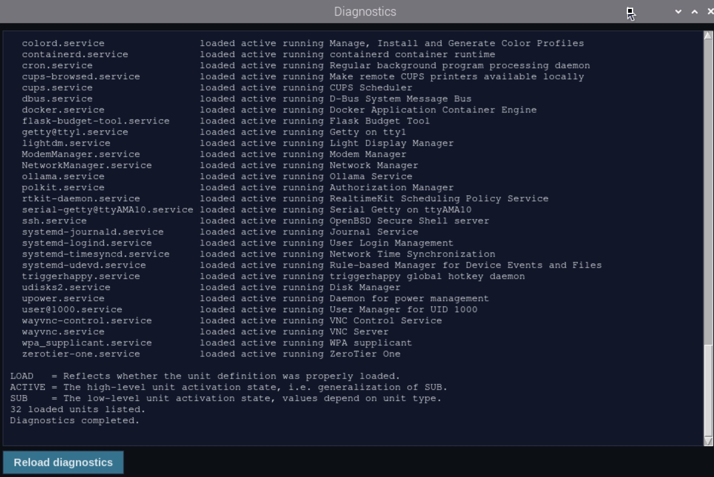
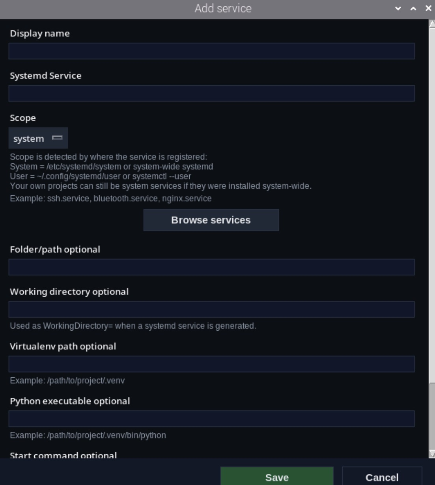

# Linux Service Center

Manage Linux services from a modern GUI or directly from a terminal interface.

Built for Raspberry Pi, Debian, Ubuntu and other Linux distributions.

⚠️ Linux only

This application requires systemd and is not compatible with Windows.

Powered by PythonXP.

---

## Features

- Modern dark themed GUI
- Interactive CLI mode
- Start / Stop / Restart services
- Enable / Disable autostart
- View service logs
- Built-in diagnostics
- Add and remove custom services
- Search installed systemd services
- Resource monitoring (CPU, RAM, Temperature, Disk)
- Local URL shortcuts
- Lightweight and beginner friendly

---

## Screenshots

### Main GUI

### Diagnostics

### Add Services

### CLI Mode

---

## Installation

Clone the repository:

git clone https://github.com/Python-XP1/Linux-Service-Center.git

cd Linux-Service-Center

Install dependencies:

pip install -r requirements.txt

Start GUI:

python px_service_gui.py

Start CLI:

python px_service_manager.py

---

## Supported Systems

- Raspberry Pi OS
- Debian
- Ubuntu
- Linux Mint
- Other Linux distributions using systemd