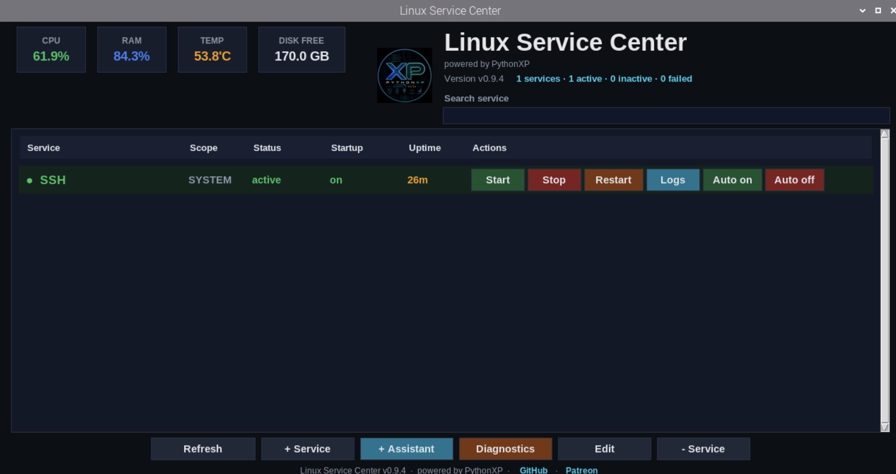
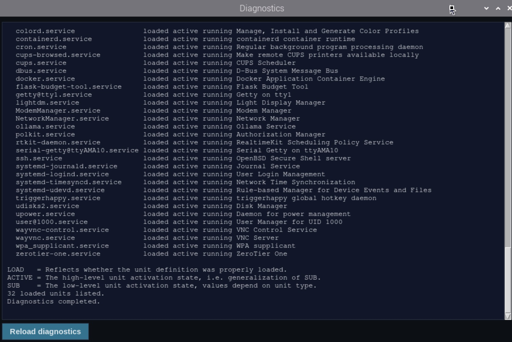
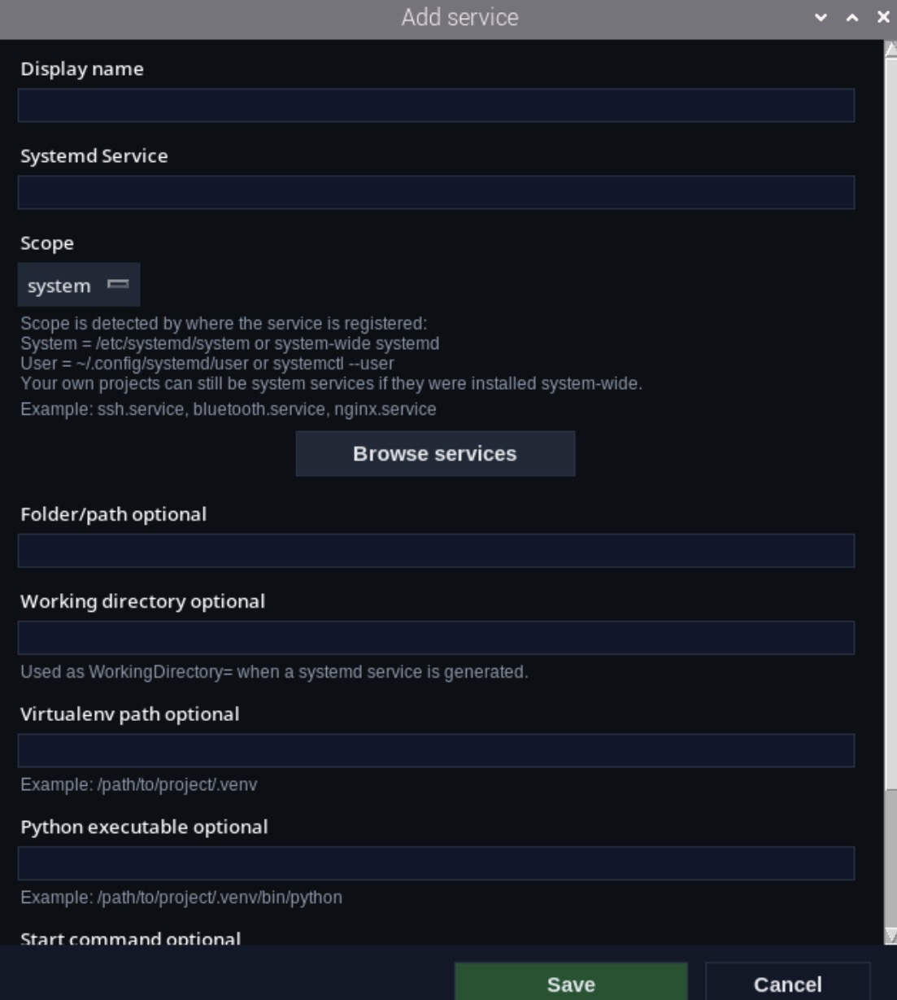

# Linux Service Center


> [!WARNING]
> ## Development branch: `dev-dbus`
>
> This branch contains the **current development state** of Linux Service Center.
>
> It is **not a finished release** and may include incomplete features, experimental code, breaking changes or bugs. The branch is published so the ongoing development can be reviewed and tested.
>
> Do not use this branch as a production-ready system management tool. For the regular public version, use the `main` branch.

Manage Linux services from a modern GUI or directly from a terminal interface.

Built for Raspberry Pi, Debian, Ubuntu and other Linux distributions.

⚠️ Linux only

This application requires `systemd` and is not compatible with Windows.

⚠️ Linux Service Center is an early-stage home lab project built for personal Raspberry Pi setups. It is not intended as a production-ready server management solution.

## Security note

System services are executed through `sudo`.

Whether a password is requested depends on your local `sudoers` configuration.

If your user has `NOPASSWD` privileges, no password prompt will appear.

Powered by PythonXP.

---

## Features

- Modern dark themed GUI
- Interactive CLI mode
- Start / Stop / Restart services
- Enable / Disable autostart
- View service logs
- Built-in diagnostics
- Add and remove custom services
- Search installed systemd services
- Resource monitoring (CPU, RAM, Temperature, Disk)
- Local URL shortcuts
- Lightweight and beginner friendly

---

## Screenshots

### Main GUI



### Diagnostics



### Add Services



### CLI Mode


---

## Installation

Clone the repository:

```bash
git clone https://github.com/Python-XP1/linux-service-center.git

cd Linux-Service-Center
```

Install dependencies:

```bash
pip install -r requirements.txt
```

## Start GUI

```bash
python -m ui.app
```

## Start CLI

```bash
python -m cli.app
```

---

## Supported Systems

- Raspberry Pi OS
- Debian
- Ubuntu
- Linux Mint
- Other Linux distributions using systemd

---

## Project Structure

```text
Linux-Service-Center/

assistant/
backends/
cli/
core/
diagnostics/
legacy/
models/
monitoring/
screenshots/
ui/
utils/

README.md
LICENSE.txt
CHANGELOG.md
```

---

## Project Status

Linux Service Center is currently under active development.

The `dev-dbus` branch is a public development snapshot and does not represent a finished or stable release. Features may still change, fail or be removed while the architecture, D-Bus integration and diagnostics are being developed.

The project focuses on providing a simple, modern and beginner-friendly interface for managing Linux services on Raspberry Pi and Debian-based systems.

Feedback and suggestions are welcome.

Built with ❤️ by PythonXP.
